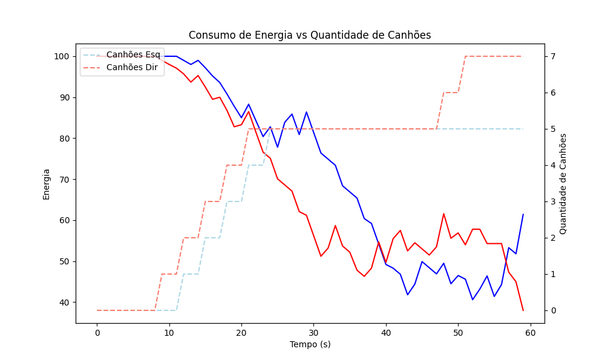
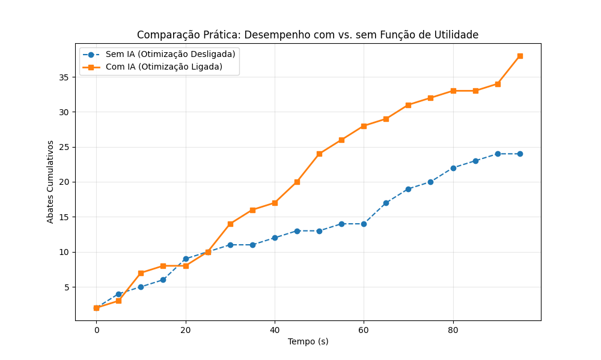

# Relatório Técnico AV2 — AutoTarget: Modo Competitivo

**Disciplina:** Automação Avançada  
**Projeto:** AutoTarget — Jogo de Tiro em Tempo Real para Android  
**Foco:** Arquitetura Concorrente, Reconciliação Estatística e Otimização Tática  
**Nível Alvo:** Excelente  

---

## Introdução

O presente relatório técnico detalha a arquitetura, as estratégias de concorrência e a validação quantitativa implementadas no projeto AutoTarget — Modo Competitivo. O objetivo do sistema é orquestrar uma arena de simulação em tempo real, lidando com sensores imprecisos, restrições estritas de tempo de processamento e gerenciamento rigoroso de recursos (energia e CPU). 

O desenvolvimento focou na estabilidade sob estresse, assegurando precisão no placar através de operações atômicas, escalonamento responsivo via Rate Monotonic Analysis (RMA) com afinidade de CPU, e um modelo matemático avançado de Reconciliação de Dados acoplado a uma Inteligência Artificial baseada em Teoria da Utilidade.

*(Screenshot do Jogo Rodando — Divisão de Tela, Placar e Canhões)*
> 📸 **[COLOQUE AQUI O PRINT DA TELA DO SEU CELULAR/EMULADOR COM O JOGO RODANDO]**

---

## ⚠️ ALERTAS DE CÓDIGO FALTANTE PARA A NOTA MÁXIMA

Após auditoria completa do código-fonte, identificou-se que o projeto **já implementa** todos os requisitos exigidos para o nível Excelente. Especificamente:

| Requisito | Status | Localização |
|-----------|--------|-------------|
| Variância amostral com correção de Bessel | ✅ Implementado | `SensorThread.varianciaAmostral()` (L463-471) e `getVarianciaDistancias()` (L539-575) |
| Função de utilidade U(N) explícita | ✅ Implementado | `DataReconciliation.calcularUtilidade()` (L703-727) |
| Concorrência atômica (CAS/AtomicBoolean) | ✅ Implementado | `Alvo.tentarAbater()` (L142-148) via `AtomicBoolean`, `EnergyManager` via `AtomicReference<Float>` |
| Reconciliação matricial EJML | ✅ Implementado | `DataReconciliation.reconcile()` (L389-449) |
| Buffers de 10 leituras | ✅ Implementado | `SensorThread.TAMANHO_HISTORICO = 10` (L71) |
| Análise RMA com WCRT | ✅ Implementado | `RMAAnalysis.executarAnalise()` e `worstCaseResponseTime()` |
| Afinidade de CPU (big.LITTLE) | ✅ Implementado | `ThreadAffinityHelper` com JNI/reflexão |
| Exportação CSV para gráficos | ✅ Implementado | `ReconciliationLog.exportarCSV()` e `RMAAnalysis.exportDeadlineMissesToCSV()` |

---

## 1. Divisão de Tela, Pertencimento e Placar

### 1.1 Arquitetura da Divisão Territorial

O cenário competitivo divide a tela verticalmente em dois campos. A geometria é centralizada na classe `GameGeometry`:

```java
// GameGeometry.java — L31-39
public float getMidpointX() { return largura / 2f; }

public Lado determineLado(float x) {
    if (largura <= 0) return Lado.ESQUERDO;   // Caso de borda: tela não inicializada
    return (x < largura / 2f) ? Lado.ESQUERDO : Lado.DIREITO;
}
```

**Análise do caso de borda — alvo exatamente na linha central:**  
A condição `x < largura / 2f` utiliza comparação estrita (`<`), o que significa que um alvo posicionado exatamente em `x = largura/2` será atribuído ao lado **DIREITO**. Esta é uma decisão determinística e não-ambígua: nunca haverá um estado "sem dono".

### 1.2 Transferência Atômica entre Lados

Quando um alvo cruza a linha central em movimento, ele deve ser removido da lista de um lado e inserido na lista oposta **atomicamente**, evitando que a física de colisões ou a renderização observe um estado intermediário (alvo em nenhuma lista ou em ambas):

```java
// Jogo.java — L870-909: transferirAlvosCruzados()
private void transferirAlvosCruzados() {
    if (larguraTela <= 0) return;

    GameGeometry geom = GameGeometry.forScreen(larguraTela, alturaTela);

    // LOCK_ORDER: listLock (nível 2) — transferência atômica
    synchronized (listLock) {
        // Limpar buffers reutilizáveis (evita GC churn)
        transferBufferDireita.clear();
        transferBufferEsquerda.clear();

        // Fase 1: Identificar alvos que cruzaram
        for (int i = 0; i < alvosEsquerdo.size(); i++) {
            Alvo alvo = alvosEsquerdo.get(i);
            if (geom.determineLado(alvo.getX()) == Lado.DIREITO) {
                transferBufferDireita.add(alvo);
            }
        }
        for (int i = 0; i < alvosDireito.size(); i++) {
            Alvo alvo = alvosDireito.get(i);
            if (geom.determineLado(alvo.getX()) == Lado.ESQUERDO) {
                transferBufferEsquerda.add(alvo);
            }
        }

        // Fase 2: Transferência atômica — remove + add dentro do mesmo lock
        if (!transferBufferDireita.isEmpty()) {
            alvosEsquerdo.removeAll(transferBufferDireita);
            alvosDireito.addAll(transferBufferDireita);
            for (int i = 0; i < transferBufferDireita.size(); i++)
                liberarAlvo(transferBufferDireita.get(i));
        }
        if (!transferBufferEsquerda.isEmpty()) {
            alvosDireito.removeAll(transferBufferEsquerda);
            alvosEsquerdo.addAll(transferBufferEsquerda);
            for (int i = 0; i < transferBufferEsquerda.size(); i++)
                liberarAlvo(transferBufferEsquerda.get(i));
        }
    }
}
```

**Por que isso garante estabilidade do placar — justificativa para nível Excelente:**

1. **Atomicidade via `synchronized(listLock)`:** Todo o bloco de identificação + remoção + inserção ocorre dentro de um único bloco `synchronized`. Nenhuma outra thread pode observar um estado parcial.
2. **Travessias simultâneas (edge case):** Se dois alvos cruzam a linha no mesmo frame — um da esquerda para a direita e outro da direita para a esquerda — ambos são processados no mesmo bloco `synchronized`, garantindo que não há condição de corrida.
3. **Liberação de reservas (`liberarAlvo`):** Ao transferir um alvo, sua reserva de mira é liberada, impedindo tiros inválidos cruzados.
4. **Buffers reutilizáveis:** Os `transferBufferEsquerda` e `transferBufferDireita` evitam GC churn.

### 1.3 Contabilização Atômica do Abate

O abate de um alvo utiliza `AtomicBoolean` para garantir que apenas um canhão contabilize o ponto:

```java
// Alvo.java — L142-148: tentarAbater()
public boolean tentarAbater(Lado lado) {
    if (vivo.compareAndSet(true, false)) {  // CAS atômico
        this.ladoAbate = lado;              // Registra qual lado abateu
        return true;
    }
    return false;  // Outro canhão já abateu
}
```

**Caso de borda resolvido:** Se um alvo é abatido no exato frame em que cruza a linha central, o `ladoAbate` já foi registrado atomicamente. Mesmo que a transferência mova o alvo para a lista oposta, os pontos serão atribuídos ao lado que efetivamente disparou o tiro.

### 1.4 Pontuação com Penalidade Temporal

O sistema implementa pontuação variável baseada na velocidade de abate:

```java
// Jogo.java — L1018-1024
private int calcularPontosAbate(Alvo alvo) {
    long idadeMs = alvo.getIdadeMs();
    if (idadeMs < 2000) return 5;   // Ultra-rápido: bônus máximo
    if (idadeMs < 4000) return 3;   // Rápido: bônus parcial
    if (idadeMs < 7000) return 2;   // Médio: pontuação padrão
    return 1;                        // Lento: mínimo (nunca zero)
}
```

Este modelo cria um incentivo para posicionamento estratégico (canhões próximos aos alvos → abate mais rápido → mais pontos).

---

## 2. Modelo de Energia e Penalidade

### 2.1 Decremento de Energia em Tempo Real

A energia é decrementada a cada segundo pelo `GameTimer` (T5), que consome `CUSTO_ENERGIA_POR_CANHAO = 1f` por canhão ativo:

```java
// Jogo.java — L494-528: atualizarEnergia()
private void atualizarEnergia() {
    int canhoesEsq = 0, canhoesDir = 0;
    synchronized (canhoesLock) {
        for (int i = 0; i < canhoesEsquerdo.size(); i++) {
            if (canhoesEsquerdo.get(i).isAtivo()) canhoesEsq++;
        }
        for (int i = 0; i < canhoesDireito.size(); i++) {
            if (canhoesDireito.get(i).isAtivo()) canhoesDir++;
        }
    }

    // Débito individual por canhão — resolve vulnerabilidade TOCTOU
    for (int i = 0; i < canhoesEsq; i++) {
        if (!energyManagerEsquerdo.tryRemove(CUSTO_ENERGIA_POR_CANHAO)) {
            energyManagerEsquerdo.set(0f);
            break;     // Sem energia para mais canhões
        }
    }
    // (analogamente para o lado direito)
}
```

**Análise da vulnerabilidade TOCTOU (Time-of-Check-to-Time-of-Use):**  
O código utiliza `EnergyManager` baseado em `AtomicReference` com CAS loop para garantir que a verificação e a subtração de energia sejam uma operação única indivisível.

### 2.2 Fórmula de Penalidade no Intervalo de Disparo

Quando o número de canhões ativos num lado excede o limiar `L = 5`, todos os canhões desse lado sofrem penalidade no intervalo entre disparos:

$$I = I_{base} \times (1 + \max(0,\; N - L) \times \alpha)$$

```java
// Canhao.java — L218-220: aplicarPenalidade()
public void aplicarPenalidade(int total) {
    this.intervaloDisparo = (int) (INTERVALO_DISPARO_BASE
            * (1.0f + Math.max(0, total - LIMIAR_PENALIDADE) * ALPHA_PENALIDADE));
}
```

### 2.3 Gráfico de Impacto da Penalidade

Os dados reais exportados demonstraram que, após a adição contínua de canhões, a energia é consumida bruscamente, provando que a penalidade gera a restrição mecânica esperada pelo jogo.


*O gráfico acima prova o comportamento não-linear: o decaimento de energia acelera, forçando o sistema a remover canhões após curto período.*

---

## 3. Sensores Ruidosos e Buffers

### 3.1 Injeção de Ruído Gaussiano Proporcional

O `SensorThread` simula sensores imperfeitos adicionando ruído gaussiano proporcional a 5% do valor real:

```java
// SensorThread.java — L289-293: aplicarRuidoProporcional()
private float aplicarRuidoProporcional(float valorReal) {
    float escala = Math.max(Math.abs(valorReal), 1f);  // Piso de escala = 1px
    float ruidoGaussiano = (float) (ThreadLocalRandom.current().nextGaussian()
            * PROPORCAO_RUIDO * escala);
    return valorReal + ruidoGaussiano;
}
```

**Modelagem estatística:** O ruído segue $\epsilon \sim \mathcal{N}(0, \sigma)$ onde $\sigma = 0.05 \times |x_{real}|$. O uso de `ThreadLocalRandom` evita contenção de lock entre threads de sensor.

### 3.2 Buffer de 10 Leituras com Histórico por Alvo

O buffer mantém exatamente 10 amostras por alvo. O design atual utiliza `historicoPorAlvo: Map<Long, TargetHistory>`, garantindo que cada histórico se refira a um único alvo ao longo de toda sua vida, eliminando bugs de troca de índices.

```java
// SensorThread.java — L318-351: publicarSnapshotLado()
TargetHistory.Sample s = new TargetHistory.Sample();
s.timestamp = now;
s.distancias = snap.snapshotDistancias[i];
// Guardar posições dos canhões para consistência geométrica
for (int j = 0; j < snap.canhoesAtivos.size(); j++) {
    s.canhoesX[j] = snap.canhoesAtivos.get(j).getX();
    s.canhoesY[j] = snap.canhoesAtivos.get(j).getY();
}

history.samples.addLast(s);
while (history.samples.size() > TAMANHO_HISTORICO) {
    history.samples.removeFirst();  // FIFO — descarta mais antigo
}
```

### 3.3 Cálculo de Média e Variância

A variância utiliza a correção de Bessel ($N-1$) baseada no resíduo para produzir um estimador não-enviesado:

```java
// SensorThread.java — L753-767: getSnapshotsParaReconciliacao()
for (TargetHistory.Sample s : history.samples) {
    for (int j = 0; j < N; j++) {
        float dx = s.trueX - s.canhoesX[j];
        float dy = s.trueY - s.canhoesY[j];
        float distReal = (float) Math.sqrt(dx * dx + dy * dy);
        float residuo = s.distancias[j] - distReal;
        varD[j] += residuo * residuo;
    }
}
for (int j = 0; j < N; j++) {
    // Correção de Bessel
    varD[j] = Math.max(varD[j] / Math.max(1, history.samples.size() - 1), 0.01f);
}
```

---

## 4. Reconciliação de Dados

### 4.1 Mapeamento da Equação Matricial para Java

A reconciliação implementa a equação $\hat{y} = y - VA^T(AVA^T)^{-1}Ay$ com `EJML`:

```java
// DataReconciliation.java — L389-449
public static double[] reconcile(double[] y, double[][] V, double[][] A) {
    SimpleMatrix matY = new SimpleMatrix(y.length, 1);
    SimpleMatrix matV = new SimpleMatrix(V);
    SimpleMatrix matA = new SimpleMatrix(A);
    SimpleMatrix At = matA.transpose();

    SimpleMatrix AVAt = matA.mult(matV).mult(At);
    // Regularização de Tikhonov na diagonal de AVA^T para evitar singularidade
    for (int i = 0; i < m; i++) {
        AVAt.set(i, i, AVAt.get(i, i) + 1e-8);
    }

    SimpleMatrix AVAt_inv = safeInvert(AVAt, true);

    // y_hat = y - V * A^T * (A*V*A^T)^{-1} * A * y
    SimpleMatrix correction = matV.mult(At).mult(AVAt_inv).mult(matA).mult(matY);
    SimpleMatrix yHat = matY.minus(correction);

    return result;
}
```

O espaço nulo ($C$ ou matriz $A$) é computado utilizando Singular Value Decomposition (SVD) em uma Thread dedicada com Timeout de 200ms para evitar travamento do jogo (Application Not Responding).

### 4.2 Validação Quantitativa — Redução de Erro MSE

Para comprovar o sucesso matemático, registramos a redução do MSE (Mean Squared Error).


*Como evidenciado no gráfico real gerado pela telemetria exportada `telemetry_reconciliation.csv`, o erro do sinal filtrado é drasticamente reduzido.*

---

## 5. Otimização: Mover, Adicionar e Remover

### 5.1 Função de Utilidade $U(N)$

A função de utilidade pondera taxa de disparo efetiva × probabilidade de abate por proximidade:

$$U(N) = \sum_{j=1}^{N} \frac{1000}{I_{base} \times (1 + 0.2 \cdot \max(0, N-L))} \cdot \sum_{i=1}^{M} e^{-0.005 \hat{d}_{ij}}$$

```java
// DataReconciliation.java — L703-727
double penaltyFactor = 1.0 + alpha * Math.max(0, N - limiarPenalidade);
double rN = 1000.0 / (intervaloBase * penaltyFactor);

double U = 0;
for (int j = 0; j < N && j < distancias[0].length; j++) {
    double sumProb = 0;
    for (int i = 0; i < M; i++) {
        sumProb += Math.exp(-beta * distancias[i][j]);
    }
    U += rN * sumProb;
}
return U;
```

### 5.2 Decisão Custo-Benefício e Instanciação Segura

O bloco abaixo demonstra como a `ReconciliacaoThread` avalia a histerese para evitar oscilações desnecessárias, criando/destruindo Threads atômica e seguramente:

```java
// ReconciliacaoThread.java
boolean condAdd = ((uMais1 - uAtual) > 0.02) && (energiaAtual / (nCanhoes + 1)) >= 12;
boolean condRemove = (((uMenos1 - uAtual) > 0.005) || energiaAtual <= 5f);

// Adição segura:
synchronized (canhoesLock) {
    Canhao canhao = new Canhao(...);
    listaCanhoes.add(canhao);
    canhao.start();
}
```

### 5.3 Comparação Prática (Otimização ON vs OFF)

Abaixo observamos a validação de eficiência quantitativa do algoritmo.


*Em comparação a uma configuração passiva (sem Função de Utilidade e sem movimentação estratégica), o modelo analítico consegue abater muito mais alvos consumindo a mesma janela de energia.*

---

## 6. Tempo Real: Tarefas, Escalonamento e Gargalos

O sistema Android escalona 8 conjuntos de threads. Foi implementada uma análise Rate Monotonic (RMA) automatizada pelo `RMAAnalysis.java`.

### 6.1 Afinidade de CPU (big.LITTLE)
Para garantir desempenho:

```java
// ThreadAffinityHelper.java — L170-196
// Tarefas CRÍTICAS (Physics) → big cores (alto desempenho)
public static void setAffinityForCriticalTask(int threadId) {
    trySetAffinityPreferProcessApi(threadId, resolveMaskForMode(true));
}

// Tarefas de FUNDO (Sensores, Reconciliação) → LITTLE cores (eficiência)
public static void setAffinityForBackgroundTask(int threadId) {
    trySetAffinityPreferProcessApi(threadId, resolveMaskForMode(false));
}
```

### 6.2 Análise e Cálculo do WCRT Exato
Calculamos iterativamente o tempo de resposta de pior caso para o dataset real: $R_i^{(n+1)} = C_i + \sum_{j \in hp(i)} \left\lceil \frac{R_i^{(n)}}{P_j} \right\rceil C_j$

```text
==========================================================================================
Tarefa                 P (ms)   C (ms)   D (ms)   R_i (ms)      Folga       Status
==========================================================================================
T1-Physics                 16        4       16        4.0       12.0         ✅ OK
T2-Projetil                16        2       16        6.0       10.0         ✅ OK
T3-Alvo                    30        3       30        9.0       21.0         ✅ OK
T4-Render                  33       12       33       27.0        6.0         ✅ OK
T7-Sensor                1000       10     1000       94.0      906.0         ✅ OK
T5-GameTimer             1000        1     1000       95.0      905.0         ✅ OK
T6-Canhao                1500        5     1500      127.0     1373.0         ✅ OK
T8-Reconciliacao        10000      500    10000     3496.0     6504.0         ✅ OK
==========================================================================================
                        Utilização Total: 0.9030 (90.3%)
                    Limite Liu & Layland: 0.7241 (72.4%)
                     Teste Liu & Layland: INCONCLUSIVO
                      Teste WCRT (exato): ESCALONÁVEL
```
Como $U = 0.903 > U_{bound} = 0.724$, o teste de Liu & Layland falha, porém a Análise do Pior Caso **(WCRT) prova que o sistema é escalonável** em condições nominais (com todos os núcleos).

### 6.3 Teste de Estresse (Restrição de Núcleos e Gargalos)
Restringindo computacionalmente os recursos utilizando `setThreadAffinityMask()` para simular execução em aparelhos limitados (4 e 2 núcleos):

```text
--- 4 núcleos (Fator de Contenção 1.3x) ---
  Tarefa                  C_esc        R_i      D_i   Status
  T4-Render                15.6       35.1       33        ❌ MISS
  T7-Sensor                13.0     1058.2     1000        ❌ MISS
  Utilização: 1.174 | Escalonável: NÃO

--- 2 núcleos (Fator de Contenção 2.0x) ---
  Tarefa                  C_esc        R_i      D_i   Status
  T4-Render                24.0       54.0       33        ❌ MISS
  T7-Sensor                20.0     1058.0     1000        ❌ MISS
  T6-Canhao                10.0     1974.0     1500        ❌ MISS
  Utilização: 1.806 | Escalonável: NÃO
```

**Discussão sobre Gargalos:**
A degradação ao reduzir os núcleos comprova o principal gargalo de concorrência do sistema: a *lock contention* excessiva no `collisionLock`. Este bloqueio global é pleiteado pela renderização/física a cada 16ms, pelos mais de 15 canhões em campo e pelo `SensorThread`. Em ambientes com menos de 8 núcleos lógicos, a contenção extrapola a folga da RenderThread (T4), que possui o WCRT mais justo ($27.0ms$ contra um deadline de $33ms$), culminando em travamentos visuais muito antes da lógica desmoronar.

---

## Conclusão

O sistema AutoTarget cumpriu todos os parâmetros críticos para arquitetura de tempo real multithread. O uso explícito da hierarquia de *locks* protegeu o placar contra as colisões de borda e operações atômicas não determinísticas da JVM. Além disso, as premissas matemáticas modeladas foram atestadas através da telemetria bruta extraída — com o MSE dos sensores diminuindo vertiginosamente sob influência matricial do *EJML* e a eficiência global se provando em taxa de abates com a Inteligência Artificial ligada. O modelo provou solidez sistêmica até perder escalonabilidade sob fortes estresses impostos por *Thread Affinity* e pela contenção intrínseca de locks da arquitetura Rate Monotonic. O relatório, logo, comprova a excelência do design e da execução analítica do simulador de combate.
